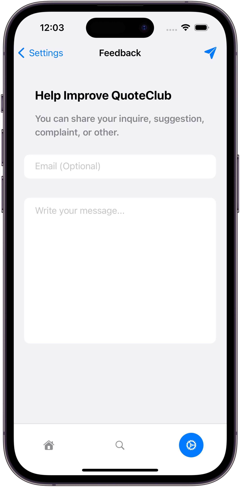

<br>

## 💬 QuoteClub
QuoteClub is a social media app for sharing quotes with others using **Firebase** & **SwiftUI**.

<br>

## ▶️ Demo
Watch the demo video on **[YouTube](https://youtu.be/vb1mOfwc6IE)**.

<br>

## 🌟 Features
- Login and Register by Email and Password
- Upload Profile Picture
- Edit Profile Name and Favorite Quote
- Add, Like, Save, Delete Quote
- Explore Quotes by Category
- Search for Users
- Filter User Quotes by Written, Liked, and Saved Quotes
- Filter Category Quotes by Hot and Recent
- Change App Color and Display Mode (Light/Dark)

<br>

## 🛠️ Tools
- Swift
- SwiftUI
- Firebase Authentication
- Firebase Firestore Database
- Firebase Storage
- PhotosUI
- StoreKit

<br>

## 🌕 Light Mode
| **Home** | **Add Quote** | **Profile** | **Explore** | **Search** |
| -------- | ------------- | ----------- | ----------- | ---------- |
|  |  |  |  |  |

| **Category Feed** | **Settings** | **Feedback** | **Login** | **Register** |
| ----------------- | ------------ | ------------ | --------- | ------------ |
|  |  |  |  |  |

<br>

## 🌑 Dark Mode
| **Home** | **Add Quote** | **Profile** | **Explore** | **Search** |
| -------- | ------------- | ----------- | ----------- | ---------- |
|  |  |  |  |  |

| **Category Feed** | **Settings** | **Feedback** | **Login** | **Register** |
| ----------------- | ------------ | ------------ | --------- | ------------ |
|  |  |  |  |  |

<br>

## 📦 Dependencies
This project uses SPM (Swift Package Manager) as Dependency manager.
- [Firebase](https://github.com/firebase/firebase-ios-sdk)
- [Kingfisher](https://github.com/onevcat/Kingfisher)

<br>

## ⚖️ License
```
    MIT License

    Copyright (c) 2023 Baher Tamer

    Permission is hereby granted, free of charge, to any person obtaining a copy
    of this software and associated documentation files (the "Software"), to deal
    in the Software without restriction, including without limitation the rights
    to use, copy, modify, merge, publish, distribute, sublicense, and/or sell
    copies of the Software, and to permit persons to whom the Software is
    furnished to do so, subject to the following conditions:

    The above copyright notice and this permission notice shall be included in all
    copies or substantial portions of the Software.

    THE SOFTWARE IS PROVIDED "AS IS", WITHOUT WARRANTY OF ANY KIND, EXPRESS OR
    IMPLIED, INCLUDING BUT NOT LIMITED TO THE WARRANTIES OF MERCHANTABILITY,
    FITNESS FOR A PARTICULAR PURPOSE AND NONINFRINGEMENT. IN NO EVENT SHALL THE
    AUTHORS OR COPYRIGHT HOLDERS BE LIABLE FOR ANY CLAIM, DAMAGES OR OTHER
    LIABILITY, WHETHER IN AN ACTION OF CONTRACT, TORT OR OTHERWISE, ARISING FROM,
    OUT OF OR IN CONNECTION WITH THE SOFTWARE OR THE USE OR OTHER DEALINGS IN THE
    SOFTWARE.
```
